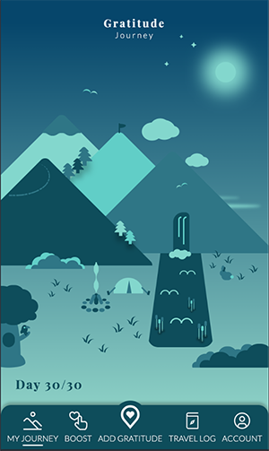

# Gratitude Journey - React/TypeScript Web App
_--- This project is still under development. Want a look at the project? You can find the Figma designs [here](https://www.figma.com/file/4V67KL6DbRxVAlX2luLehm/Mobile-Design?node-id=3%3A5&t=PNUwAicSCsyklQyL-1) ---_

## Index

1.0 Introduction  
1.1 What does the project do?  
1.2 What functions do the project have?   
1.3 Visual preview of a full journey

2.0 Installation and requirements  
2.1 Available Scripts  

3.0 Need some help?  

4.0 Who maintains and contributes to the project?

## 1.0 Introduction

**1.1 What does the project do?**

We are often focused on our end goal, unaware that we've already come a long way to be able to set this goal at all.

With Gratitude Journey you can look back on your life's journey. At times when you encounter difficulties on the journey to your goal and you can use a positivity boost, or as a reflection on your journey to see how you have grown as a person.

**1.2 What functions do the project have?**

- Save your daily gratitude
- Looking back on previous gratitudes
- With every added gratitude, your landscape grows visually
- Each journey consists of 30 days, with 30 gratitudes and 30 visual items in your landscape

**1.3 Visual preview of a full journey (30 days)**

Every visual item in the journey is created with CSS. Not because this makes sense, but because I just think it's cool and a fun activity to make CSS art. With every gratitude you add, a CSS art item will be added to your landscape.

The items are inspired by the paintings of Bob Ross (a great hero to me). I used [this research](https://www.statista.com/statistics/296326/elements-contained-in-paintings-by-bob-ross/) as inspiration, in which they investigated which items are most common in his paintings.  

Mobile version (iPhone 14 Pro)

## 2.0 Installation and Requirements

_Under construction_

**2.1 Available Scripts**

In the project directory, you can run:

### `npm start`

Runs the app in the development mode.\
Open [http://localhost:3000](http://localhost:3000) to view it in the browser.

The page will reload if you make edits.\
You will also see any lint errors in the console.

### `npm test`

Launches the test runner in the interactive watch mode.\
See the section about [running tests](https://facebook.github.io/create-react-app/docs/running-tests) for more information.

### `npm run build`

Builds the app for production to the `build` folder.\
It correctly bundles React in production mode and optimizes the build for the best performance.

The build is minified and the filenames include the hashes.\
Your app is ready to be deployed!

See the section about [deployment](https://facebook.github.io/create-react-app/docs/deployment) for more information.

### `npm run eject`

**Note: this is a one-way operation. Once you `eject`, you can’t go back!**

If you aren’t satisfied with the build tool and configuration choices, you can `eject` at any time. This command will remove the single build dependency from your project.

Instead, it will copy all the configuration files and the transitive dependencies (webpack, Babel, ESLint, etc) right into your project so you have full control over them. All of the commands except `eject` will still work, but they will point to the copied scripts so you can tweak them. At this point you’re on your own.

You don’t have to ever use `eject`. The curated feature set is suitable for small and middle deployments, and you shouldn’t feel obligated to use this feature. However we understand that this tool wouldn’t be useful if you couldn’t customize it when you are ready for it.

## 3.0 Need some help?

If you have any issues with installing, or you have questions about the project, let me know! I am happy to help you out. You can find my contact details at my [GitHub profile](https://github.com/AnnemiekNieboer/)

## 4.0 Who maintains and contributes to the project?

Me! Annemiek Nieboer. See the most recent updates at the [GitHub repository](https://github.com/AnnemiekNieboer/frontend-react-eindopdracht-color-palette/tree/feature/assignment) of this project. This project is still under construction at the moment, so do not expect a fully functioning project at the moment ;-)